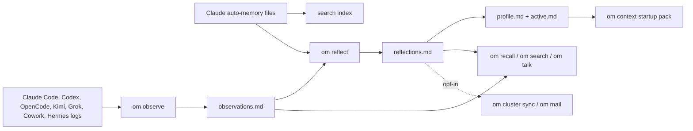

# Observational Memory


[](https://pypi.org/project/observational-memory/)
[](https://github.com/intertwine/observational-memory/releases/latest)
[](https://pypi.org/project/observational-memory/)
[](https://pypi.org/project/observational-memory/)
[](https://github.com/intertwine/observational-memory/actions/workflows/ci.yml)
[](https://github.com/intertwine/observational-memory/stargazers)

**One local memory for your AI coding agents — so every session starts knowing your work instead of starting over.**

Observational Memory, or `om`, watches what you do with Claude Code, Codex, OpenCode, Kimi Code CLI, Grok Build TUI, and Claude Cowork (Hermes joins through its [plugin](docs/hermes-plugin.md)), distills it into plain Markdown on your machine, and hands every new session a compact memory summary. What Claude learns today, Codex knows tomorrow.

- **No more cold starts.** Every session begins knowing who you are, how you work, and what you were doing.
- **One memory across agents.** Switch tools without losing context.
- **Your memory is yours.** Plain Markdown files on your machine — readable, searchable, backed up, never silently uploaded.

## New in v0.9.1

v0.9.0 put background observation in a bounded worker lane. v0.9.1 closes the paths that could still slip past it:

- **Claude checkpoints use the bounded lane on every platform** - `om install --claude` now wires hooks to route through `om claude-checkpoint` everywhere instead of spawning direct observe processes from a shell script.
- **Background workers get a memory ceiling** - a once-per-second check stops any background worker found over `OM_OBSERVER_WORKER_MAX_RSS_MB` (default 4096 MiB); workers stopped for memory are reported as `memory_exceeded`, distinct from `timeout`.
- **Transcript scanning streams** - Claude and Codex JSONL parsing and counting read line by line instead of loading whole transcripts into memory.

Upgrading:

```bash
brew upgrade observational-memory   # or: uv tool upgrade observational-memory
om install --claude
om doctor
```

The `om install --claude` step matters this time: it switches your installed hooks to the bounded lane. Full details: [v0.9.1 release notes](docs/RELEASE-0.9.1.md).

v0.9.1 builds on v0.9.0, which added OpenCode support, Kimi Code CLI support, and the bounded observer lane — see the [v0.9.0 release notes](docs/RELEASE-0.9.0.md).

## Quick Install

macOS with Homebrew:

```bash
brew install intertwine/tap/observational-memory
om install
om doctor
```

Linux, macOS, or Windows with `uv`:

```bash
uv tool install observational-memory
om install
om doctor
```

`om install` sets up Claude Code and Codex by default (`--all` adds OpenCode, Kimi, Grok, and Cowork) and asks which LLM provider to use — a metered API key, or your existing ChatGPT or SuperGrok subscription via `om login`. If you use Anthropic through Vertex AI or Bedrock, install with `uv tool install "observational-memory[enterprise]"` instead of Homebrew, then run `om install`.

## How Memory Flows



## First Week Workflow

1. Install `om`.
2. Run `om install` and answer the provider questions.
3. Run `om doctor`.
4. Use Claude Code, Codex, OpenCode, Kimi, or Grok normally — memory accumulates on its own.
5. Search memory when you need it:

```bash
om recall --query "current project status"
om search "release checklist"
```

6. Talk to your memory (experimental — it works, but flags may change), or check what new sessions will see:

```bash
om talk --query "what was I working on last week?"
om context --for codex --cwd "$PWD" --task "finish docs"
```

## Where Your Memory Lives

`om` keeps four plain-Markdown files you can read, search, and back up:

| File | Purpose |
| --- | --- |
| `observations.md` | Recent notes from sessions and checkpoints. |
| `reflections.md` | Longer-term facts, preferences, decisions, and active work. |
| `profile.md` | Compact stable context for startup. |
| `active.md` | Compact current context for startup. |

| Platform | Memory directory | Config directory |
| --- | --- | --- |
| macOS / Linux | `~/.local/share/observational-memory/` | `~/.config/observational-memory/` |
| Windows | `%LOCALAPPDATA%\observational-memory\` | `%APPDATA%\observational-memory\` |

Set `OM_MEMORY_DIR` to keep the Markdown files somewhere else, such as an
Obsidian vault.

## Common Commands

```bash
om status
om doctor                       # health check, now with memory-growth report
om observe --source codex
om reflect
om reflect --check-conflicts    # reflect + flag silently-changed high-stakes facts
om reflect --async              # offline OpenAI Batch job at ~50% of the synchronous price
om jobs poll                    # apply completed async jobs
om backup --reason pre-experiment
om restore --list
om recall --query "what was decided about sync?"
om talk
om search "preferences" --json
om usage status                 # token usage, cost, and budgets
om usage budget set --daily-usd 5.00
om context --quality-report     # startup-context dedup / freshness / budget report
om export --target chatgpt
```

Multi-machine and agent-to-agent memory are opt-in:

```bash
# OM Cluster: encrypted full sync across YOUR machines
om cluster init --name "Personal Memory" --transport filesystem:~/Sync/om-cluster --import-existing
om cluster sync

# OM Mail (experimental): selective memory exchange between DISTINCT agents.
# Peers must exchange and pin keys first — see docs/mail-memory.md.
om mail init --username my-agent
om mail peers add peer@agentmail.to --key <PEER_PUBLIC_KEY> --shared-key <SHARED_KEY>
om mail send-note peer@agentmail.to --text "decision: ship v0.9.0"
om mail sync
```

Do not sync `~/.local/share/observational-memory/` directly with Dropbox, iCloud, Syncthing, rsync, or a NAS. Use the cluster transport directory instead.

## Agent Support

| Host | Current support |
| --- | --- |
| Claude Code | Hooks for startup context and checkpoints. |
| Codex | Hooks-first startup and Stop checkpoints, with an AGENTS fallback. |
| OpenCode | Global plugin records message events, with a global AGENTS fallback for startup context. |
| Kimi Code CLI | Hooks for startup context plus prompt/subagent checkpoints captured from Kimi lifecycle JSON. |
| Grok Build TUI | Native hook file with Claude-compatibility awareness, plus `updates.jsonl` observation. |
| Claude Cowork | Local plugin on macOS with hooks and `/recall`. |
| Hermes | External memory-provider plugin through [intertwine/hermes-observational-memory](https://github.com/intertwine/hermes-observational-memory), plus manual session-log ingestion. |
| Aside browser | Draft first-class support is under active development in PR [#98](https://github.com/intertwine/observational-memory/pull/98); not shipped in v0.9.0. |
| ChatGPT / Claude Managed Agents | Reviewed export bundles through `om export` — not live sync; `om` never silently writes hosted memory. |

Out-of-tree integrations have first-class seams: mail providers and CLI add-ons plug in through public entry points ([CONTRIBUTING.md](CONTRIBUTING.md)).

## Architecture At A Glance

<p align="center">
  
</p>

- `om observe` turns transcripts into recent notes.
- `om reflect` turns recent notes into durable memory — with provenance, scope rules, and a safety snapshot first.
- `om context` gives agents a bounded memory summary at session start.
- `om recall`, `om search`, and `om talk` retrieve more when that summary is not enough.
- `om export` prepares reviewed memory seed bundles for hosted systems.
- `om cluster` syncs encrypted records across machines when you opt in.
- `om mail` (experimental) exchanges signed memory between distinct agents over email.

## Guides

- [Documentation index](docs/README.md)
- [Install and setup](docs/install.md)
- [Platform integrations](docs/integrations.md)
- [Hermes plugin](docs/hermes-plugin.md)
- [Search, recall, and startup context](docs/search-and-recall.md)
- [Talk to your memories (`om talk`)](docs/talk-to-memories.md)
- [Configuration](docs/configuration.md)
- [OM Cluster sync](docs/om-cluster-sync.md)
- [OM Mail: email inboxes as a memory substrate (experimental)](docs/mail-memory.md)
- [OM Cluster validation checklist](docs/om-cluster-validation.md)
- [Host memory coexistence](docs/coexistence.md)
- [Maintainer guide](docs/MAINTAINERS.md)

## Version

Current release: **v0.9.1** — [release notes](docs/RELEASE-0.9.1.md). Built on v0.9.0's broader bounded agent memory, v0.8.0's trustworthy-memory release, and v0.7.0's section-targeted reflection. Maintainers: the release workflow lives in [docs/MAINTAINERS.md](docs/MAINTAINERS.md).

## Contributing

The `om` core is MIT licensed and stays that way. Pull requests are welcome —
see [CONTRIBUTING.md](CONTRIBUTING.md) for development setup and contributor
terms (DCO sign-off plus a relicensing grant to Intertwine AI, the project
steward, which also builds separately licensed team add-ons on the core's
public plugin interfaces).
